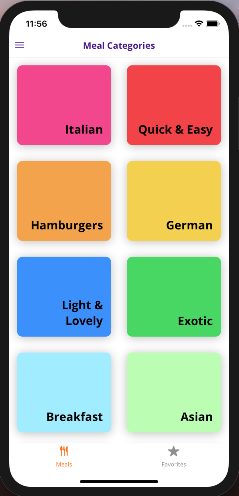
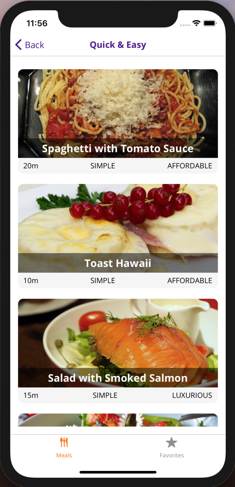
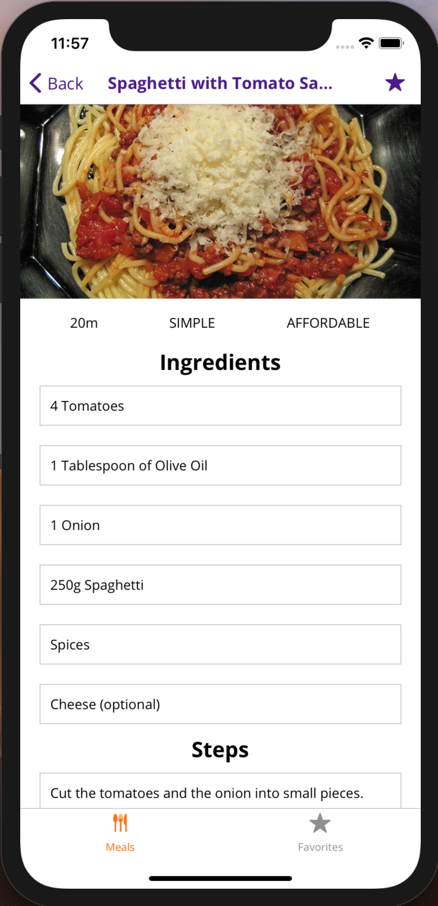
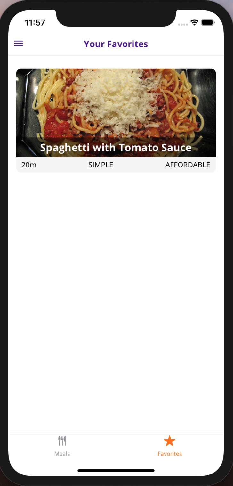
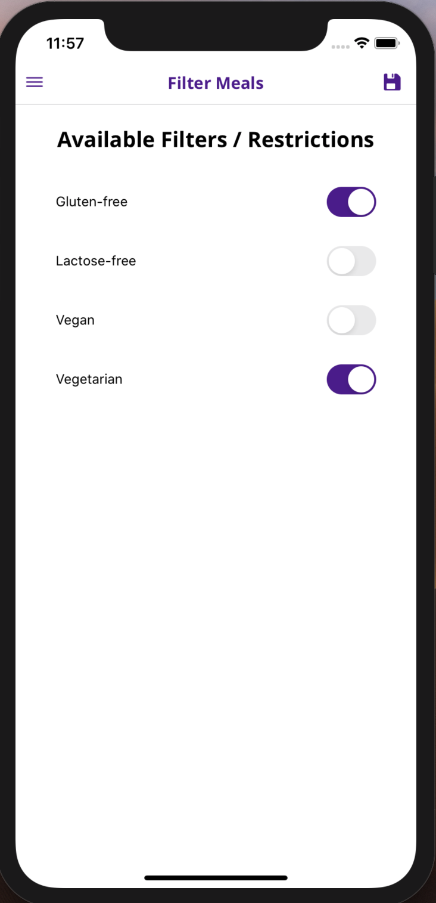

# rn-meals
React Native Meals Application

Demo app of to choose a receipt from, filter, get details, add to favourites

To start this project:

npm install expo-cli -- global
clone https://github.com/Smetukh/rn-meals.git
yarn install
yarn start
launch AVD in the SDK emulator/IOS emulator
press a or i in the terminal to start with Android/IOS emulator
enjoy app in the emulator

